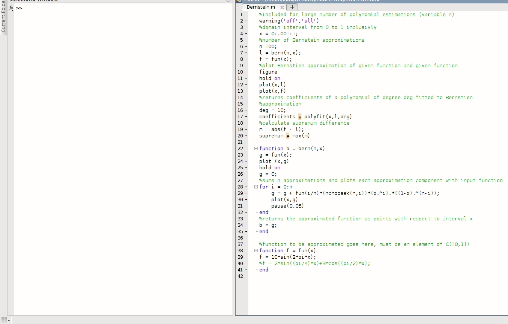

# math_help
This repository is a series of matlab and python scripts that I wrote during different parts of my undergrad. Each of these scripts were either assigned as a homework problem or written to confirm computational questions. Python 3.6 and Matlab > 2015. The only python dependency is numpy.
 
## Contents
The scripts in this repository are,
* `stoch_control_algorithms.py`
    * Value iteration, policy iteration and Q learning
* `QuantizerLloydMax.m`
   * Lloyd max training set version algorithm w/ MSE distortion
* `Berstein.m`
    * An implementation of the Berstien approximation
* `GramS.m`
    * Conduct Gram-Schmidt process 
* `PhaseP.m`
    * Plot phase portrait for ODE
 
Here is a screen recording of `Bernstein.m`.

 
    

